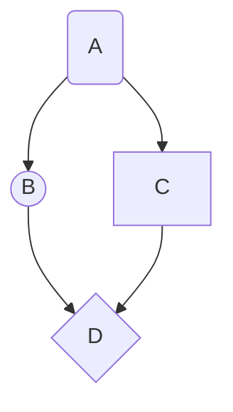

# Mermaid Test
```md
graph TD;
    A("A")
    B(("B"))
    C["C"]
    D{"D"}

    A-->B;
    A-->C;
    B-->D;
    C-->D;
```
>is

```mermaid
graph TD;
    A("A")
    B(("B"))
    C["C"]
    D{"D"}

    A-->B;
    A-->C;
    B-->D;
    C-->D;
```