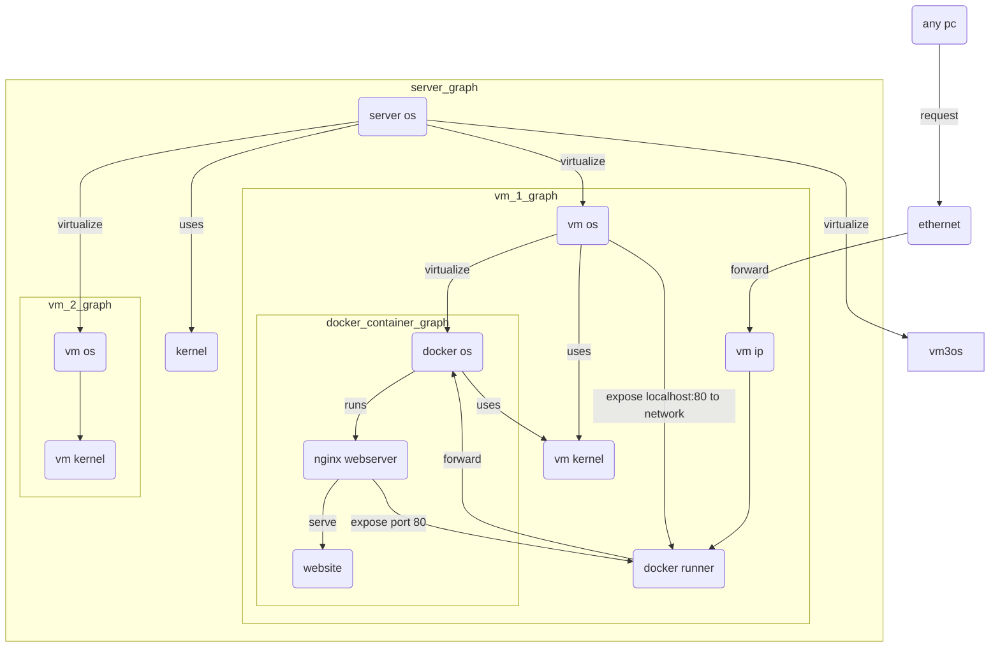

# container layout

```mermaid
flowchart TD
    subgraph server_graph
        servKern(kernel)
        servOs(server os)


        subgraph vm_1_graph

            vm1kernel(vm kernel)
            vm1os(vm os)

            subgraph docker_container_graph
                direction TB

                dockOs(docker os)
                nginx(nginx webserver)
                site(website)
            end
            
            vmIP(vm ip)
            dock(docker runner)

            dock -- forward ---> dockOs
            vm1os -- virtualize --> dockOs
            dockOs -- runs --> nginx
        end
        subgraph vm_2_graph
            vm2kernel(vm kernel)
            vm2os(vm os)

            vm2os --> vm2kernel 

        end
    end

    any(any pc)
    eth(ethernet)

    servOs -- uses ---> servKern

    nginx -- expose port 80 --> dock
    nginx -- serve --> site

    vm1os -- expose localhost:80 to network --> dock
    vmIP ---> dock

    eth -- forward --> vmIP

    dockOs -- uses --> vm1kernel
    vm1os -- uses ---> vm1kernel

    any -- request ---> eth

    servOs -- virtualize --> vm1os
    servOs -- virtualize ---> vm2os
    servOs -- virtualize ---> vm3os
```

## feedback

- [ ] where does the docker img come from??
