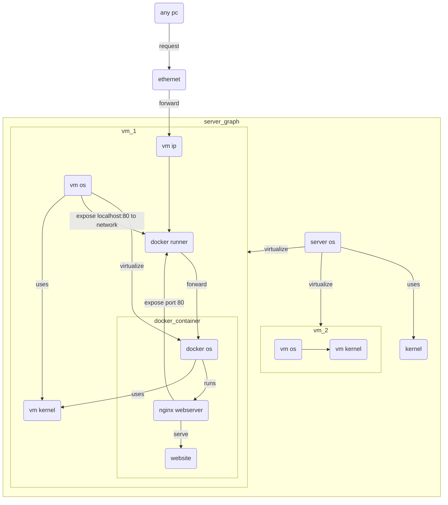

# container layout



## feedback

- where does the docker img come from ??
  - in this setup it comes from building it locally using a Dockerfile and docker-compose.yml
    - > ./Dockerfile
      >
      >```docker
      >FROM nginx:1.23
      >
      ># copy build book to docker html dir
      >COPY book/ /usr/share/nginx/html/
      >
      ># copy nginx config from local config directory to      >container /etc/nginx directory
      >COPY config/* /etc/nginx/
      >
      ># exposes port 80 from the container to the outside
      >EXPOSE 80
      >```
      >
      >---
    - > ./docker-compose.yml
      >
      >```yaml
      >version: "3"
      >services:
      >  website:
      >    build: . # uses the local Dockerfile to build a   container
      >    ports: # expose (device:container) port 5000:80
      >      - "5000:80"
      >    restart: unless-stopped # keeps the container   running until it is manually stopped
      >
      >```
      >
      >---
