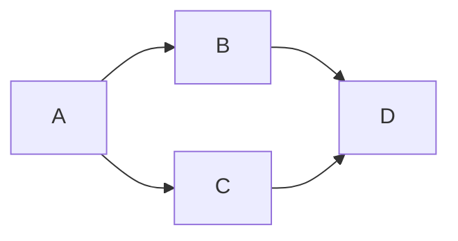

# Intro

```mermaid
graph LR;
    A-->B;
    A-->C;
    B-->D;
    C-->D;
```

## things used

- mdbook (static site generator using md files)
- mdbook-mermaid (mermaid support for mdbook)
- docker
