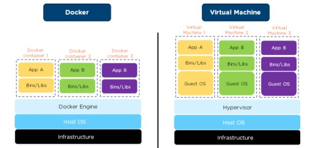

# What did i learn

>before learning about docker i used to look at it with a side eye,
>naivly thinking it wasn't something i would use or think it would be usefull to me.
>but i changed my mind about it after being challanged to make something using docker.
>
>by using docker instead of a complete VM you're able to do essentially the same with less resources.

## [docker](https://docker.com/)

>"Docker helps developers bring their ideas to life by conquering the complexity of app development. We simplify and accelerate development workflows with an integrated dev pipeline and through the consolidation of application components." -- [docker](https://www.docker.com/company/)

the goal of docker is to run an "app" inside a container, and to run multiple containers of that "app" to make sure the customer always has an end point to connect to.

## containers

a container can be seen as a slice of a vm with it's own filesystem which you can hook into with "persistent volumes" to save data from the container on the host vm.

```docker
# make a new container based off nginx on version 1.23
FROM nginx:1.23

# copy build book to docker html directory
COPY book/ /usr/share/nginx/html/

# copy nginx config from local config directory to container /etc/nginx directory
COPY config/* /etc/nginx/

# exposes port 80 from the container to the outside
EXPOSE 80
```

## [docker-compose](https://hub.docker.com/r/docker/compose/#!)

docker compose uses a yml files to stucture out multiple containers.

by defining multiple containers in a compose file you can easily replicate
it on multiple machines, or even test multiple versions on the same machine
(providing you give them unique names if they are on the same host).

```yaml
version: "3"
services:
  website:
    build: . # uses local dockerfile to build a container
    ports: # expose (device:container) 80:80
      - "80:80"
    restart: unless-stopped # keeps the container running until it is manually stopped
  portainer:
    image: portainer/portainer-ce:latest # clones a container from docker-hub from user: "portainer" named: "portainer-ce" using the "latest" tag
    container_name: portainer # sets a unique user defined name
    restart: unless-stopped
    security_opt: # overwrites security flags
      - no-new-privileges:true # this flag makes sure that the current process or any of its children do not change or gain other capabilities
      # source <https://projectatomic.io/blog/2016/03/no-new-privs-docker/>
    volumes:
      - /etc/localtime:/etc/localtime:ro # read-only, share the time of the host with the container
      - /var/run/docker.sock:/var/run/docker.sock:ro # read-only, share the docker network socket of the host with the container
      - ./portainer-data:/data # full access, shares the data from the local folder "./portainer-data" with the directory "/data"
    ports:
      - 9000:9000
```

## containers vs virtual machines

while virtual machines give you full systems to manage and work with, if managed incorrectly gives a whole lot of troubles.

docker removes the operating system from the stack by using the kernel of the host OS and can run multiple workloads while vms would need a full vm for sertain workloads.


[img-source](https://www.simplilearn.com/tutorials/docker-tutorial/docker-vs-virtual-machine)

docker containers also require less resources since they dont require the full os in the stack which also gives them fast boot time.
